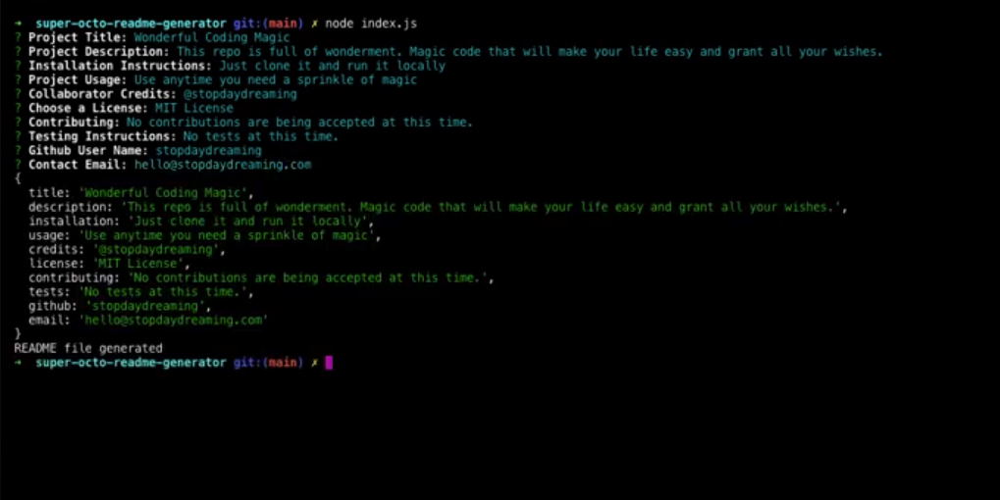

# README  📖 Generator 

## Description 
A command-line application that generates a high quality README file. The content of the README is generated by user prompts and feedback. This app allows the project creator to devote more time to working on the project.

## Table of Contents
* [Installation](#installation)
* [Usage](#usage)
* [Credits](#credits)
* [License](#license)
* [Features](#features)
* [Contributing](#contributing)
* [Tests](#tests)
* [Badges](#badges)

## Installation
### Steps required to run locally
1. Clone/download the code in this repo
2. Navigate to the location of the code downloaded
3. Double-click on the html file provided in the downloaded code to preview
### Steps required to run online
1. Click the "VIEW SITE" link at the bottom of this README

## Usage 
This code should be used for the purpose of creating/editing code for a README generator. This code has not been deployed to a live site. It must be run locally.

## Credits
1 contributor: @stopdaydreaming  

## License
Copyright (c) README Generator. All rights reserved.
Licensed under the [MIT](license.txt) license.

## Features
None at this time

## Contributing
None at this time

## Tests
None at this time  

## Badges
